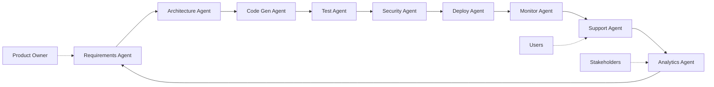

# What if...?

Advanced scenarios and future visions

---
layout: default
---

# What if agents learn? 🧠

<div class="grid grid-cols-2 gap-8">
<div>

## Adaptive Agents
- **Pattern Recognition**: Learning from code history
- **Team Preferences**: Adapting to coding style
- **Domain Knowledge**: Gathering business context
- **Performance Tuning**: Optimization through feedback

```typescript
class LearningAgent {
  async adaptToTeam(pullRequests) {
    const patterns = this.analyzePatterns(pullRequests);
    this.updatePrompts(patterns);
    this.personalizeResponses();
  }
}
```

</div>
<div>

## Emergent Behavior
- Agents develop **their own strategies**
- **Collaboration** without explicit programming
- **Creative solution approaches** emerge
- **Domain-specific** expertise develops

</div>
</div>

---
layout: default
---

# What if agents become proactive? 🔮

## Scenario: Predictive Development

```typescript
class PredictiveAgent {
  async analyzeTrends() {
    // Detect patterns before problems occur
    const codeSmells = await this.detectEmergingPatterns();
    const securityRisks = await this.predictVulnerabilities();
    const performanceIssues = await this.forecastBottlenecks();
    
    // Proactive measures
    await this.scheduleRefactoring(codeSmells);
    await this.upgradeVulnerableDependencies(securityRisks);
    await this.optimizeHotPaths(performanceIssues);
  }
}
```

<div class="mt-4 p-4 bg-yellow-100 rounded-lg">
<strong>Vision:</strong> Agents that solve problems before they emerge
</div>

---
layout: two-cols-header
layoutClass: gap-16
---

# What if agents become creative? 🎨

::left::

## Code Creativity
- **Invent new patterns**
- **Discover optimal algorithms**
- **Propose innovative architectures**
- **Explore alternative solutions**

```typescript
// Agent experiments with approaches
class CreativeAgent {
  async solveOptimally(problem) {
    const approaches = [
      () => this.traditionalSolution(problem),
      () => this.functionalApproach(problem),
      () => this.experimentalPattern(problem)
    ];
    
    return await this.findBestSolution(approaches);
  }
}
```

::right::

## Multi-Domain Expertise
- **Cross-pollination** between technologies
- **Best practices** from various domains
- **Hybrid solutions** with unexpected combinations

<div class="mt-8 p-4 bg-purple-100 rounded-lg">
<strong>Example:</strong> Agent combines gaming patterns with fintech security
</div>

---
layout: default
---

# What if agents communicate? 💬

## Agent-to-Agent Communication

```typescript
class AgentCommunication {
  async consultPeers(problem) {
    const experts = await this.findExpertAgents(problem.domain);
    
    const consultations = await Promise.all(
      experts.map(expert => expert.advise(problem))
    );
    
    const consensus = await this.negotiateConsensus(consultations);
    return this.synthesizeApproach(consensus);
  }
}
```

## Collective Intelligence
- **Swarm intelligence** for complex problems
- **Decentralized decision-making**
- **Knowledge sharing** between agent instances
- **Collaborative problem solving**

---
layout: default
---

# What if agents take over the entire SDLC? 🔄



<div class="text-center mt-4">
<strong>Vision:</strong> Fully autonomous Software Development Lifecycle
</div>

---
layout: default
---

# Edge Cases & Challenges 🚨

<div class="grid grid-cols-2 gap-8">
<div>

## Technical Challenges
- **Hallucinations** with complex problems
- **Context windows** with large codebases
- **API rate limits** with intensive usage
- **Determinism** vs. creativity

```typescript
// Validation critical
class ValidationAgent {
  async validateOutput(code) {
    const tests = await this.generateTests(code);
    const security = await this.securityScan(code);
    const performance = await this.benchmarkCode(code);
    
    return this.combineValidations([tests, security, performance]);
  }
}
```

</div>
<div>

## Ethical & Social
- **Job displacement** - What happens to junior devs?
- **Code ownership** - Who is responsible?
- **Skill atrophy** - Do we lose coding skills?
- **Bias in code** - Do agents reproduce prejudices?

</div>
</div>

---
layout: default
---

# What if we had an Agent IDE? 💻

## Future IDE Concept

```typescript
class AgentIDE {
  async onFileOpen(file) {
    // Intelligent code analysis in background
    const suggestions = await this.contextAgent.analyzePotential(file);
    this.showSmartSuggestions(suggestions);
  }
  
  async onCodeChange(change) {
    // Real-time refactoring suggestions  
    const improvements = await this.refactorAgent.suggest(change);
    
    // Auto-generate tests
    const tests = await this.testAgent.generate(change);
    
    // Update documentation
    await this.docAgent.updateRelevantDocs(change);
  }
}
```

<div class="text-center mt-4 p-4 bg-green-100 rounded-lg">
<strong>Vision:</strong> IDE becomes a team of expert agents
</div>

---
layout: default
---

# Extreme Scenarios 🌟

## What if...

<div class="space-y-4">

**🤖 Agents write agents**: Self-evolving agent systems

**🌍 Global agent network**: Worldwide knowledge and experience exchange  

**⚡ Real-time code evolution**: Code automatically adapts to new requirements

**🎯 Intent-based programming**: "I need an e-commerce app" → finished app

**🔮 Quantum code optimization**: Agents use quantum computing for code optimization

</div>

<div class="mt-8 text-center">
<strong>Timeline:</strong> 2025-2030 → Gradual reality
</div>

---
layout: fact
---

# The Tipping Point

<div class="text-3xl">

**2024**: Assistants (Level 2)  
**2025**: Autonomous agents (Level 3-4)  
**2026**: Agent teams (Level 4-5)  
**2027+**: Full autonomy (Level 5)

</div>

<div class="text-center mt-8 text-xl opacity-75">
We're at the beginning of a new era
</div>

---
layout: center
class: text-center
---

# 🎯 Time for concrete tools!

## Claude Code: Agentic Development today

<div class="text-sm mt-8 opacity-75">
From vision to implementation
</div>