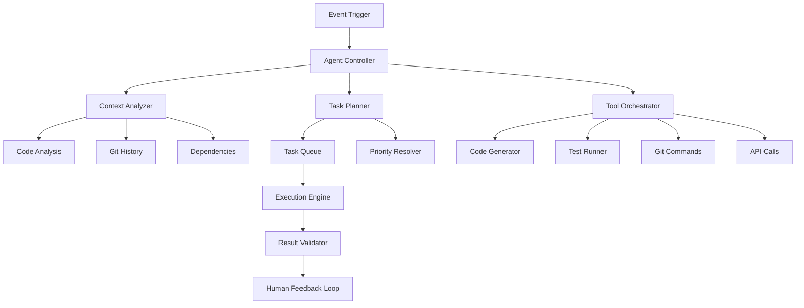

# What is Agentic Coding?

Concepts, Patterns and Architecture

---
layout: default
---

# Definition: Agentic Coding 🎯

<div class="text-lg mb-8">

**Agentic Coding** is a paradigm where autonomous **software agents** 
independently execute, analyze, and optimize code-related tasks.

</div>

## Core Characteristics

- **🧠 Autonomous**: Agents make independent decisions
- **🔄 Reactive**: Respond to events and changes  
- **🎯 Goal-oriented**: Work towards defined objectives
- **🔗 Collaborative**: Communicate with other agents
- **📊 Context-aware**: Fully understand code context

---
layout: two-cols
layoutClass: gap-16
---

# Agent vs. Tool 🆚

## 🛠️ Traditional Tool
```yaml
Input: "Fix this bug"
Process: Manual steps required
Output: Partial solution
Human: Reviews and completes
```

- Requires explicit instructions
- Limited context understanding
- Single-purpose functionality
- Human oversight needed

::right::

## 🤖 Agentic System
```yaml
Input: "Repository has issues"
Process: Agent analyzes automatically
Output: Complete solution + PR
Human: Reviews final result
```

- Interprets intent and context
- Multi-step problem solving
- Learns from patterns
- End-to-end automation

---
layout: default
---

# Agentic Architecture 🏗️



---
layout: default
---

# Agent Types in Development 🎭

<div class="grid grid-cols-2 gap-8">
<div>

## Code Agents
- **Code Generator**: Writes new code
- **Refactor Agent**: Optimizes existing code  
- **Test Agent**: Generates and runs tests
- **Security Agent**: Scans for vulnerabilities

</div>
<div>

## Process Agents  
- **PR Agent**: Creates and reviews Pull Requests
- **Issue Agent**: Classifies and resolves issues
- **Deploy Agent**: Automates deployments
- **Monitor Agent**: Monitors system health

</div>
</div>

---
layout: two-cols
layoutClass: gap-16
---

# Reactive vs. Proactive Agents

## ⚡ Reactive Agents
- React to **Events**
- GitHub Webhooks
- CI/CD Pipeline Failures
- Issue Creation
- PR Submissions

```typescript
// Event-driven
webhook.on('pull_request', async (event) => {
  await codeReviewAgent.analyze(event.data);
});
```

::right::

## 🔮 Proactive Agents
- **Scheduled** Analysis
- Code Quality Monitoring  
- Dependency Updates
- Performance Optimization
- Security Scanning

```typescript
// Schedule-driven
cron.schedule('0 2 * * *', async () => {
  await securityAgent.scanAllRepos();
});
```

---
layout: default
---

# Agent Communication Patterns 📡

## 1. Event Bus Pattern
```typescript
const eventBus = new EventBus();

eventBus.subscribe('code.changed', (event) => {
  testAgent.run(event.files);
  lintAgent.check(event.files);
});
```

## 2. Pipeline Pattern  
```typescript
const pipeline = new AgentPipeline([
  codeAnalysisAgent,
  testGenerationAgent, 
  codeReviewAgent,
  deploymentAgent
]);

await pipeline.execute(pullRequest);
```

## 3. Orchestrator Pattern
```typescript
class WorkflowOrchestrator {
  async handleIssue(issue) {
    const analysis = await analysisAgent.process(issue);
    const code = await codeGenAgent.generate(analysis);
    const tests = await testAgent.create(code);
    return await prAgent.submit(code, tests);
  }
}
```

---
layout: fact
---

# 5 Levels of Agentic Autonomy

<div class="text-2xl">

**Level 0**: Manual - Everything manual  
**Level 1**: Assisted - Tool supports  
**Level 2**: Partial - Agent executes sub-tasks  
**Level 3**: Conditional - Agent decides in known cases  
**Level 4**: High - Agent acts autonomously with human oversight  
**Level 5**: Full - Fully autonomous agents  

</div>

<div class="text-center mt-8 text-lg opacity-75">
Today: Level 2-3 | Future: Level 4-5
</div>

---
layout: center
class: text-center
---

# 🎯 Next Step

## Claude Code as a concrete tool for Agentic Development

<div class="text-sm mt-8 opacity-75">
From theory to practice
</div>