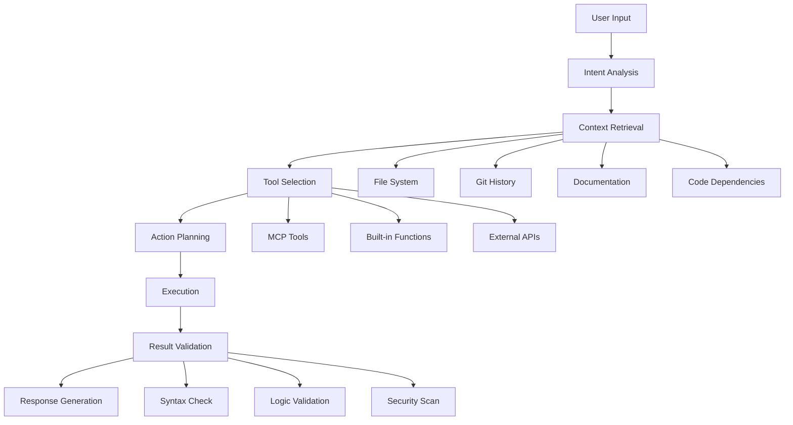

# What is Claude Code?

Features, Capabilities and Architecture

---
layout: default
---

# Claude Code: The Components 🧩

<div class="text-lg mb-6">

**Claude Code** is an **AI-powered Development Environment** that consists of several 
integrated components.

</div>

<div class="grid grid-cols-3 gap-6">
<div class="p-4 bg-blue-50 rounded-lg">

### 🧠 LLM Core
- Claude 3.5 Sonnet
- 200k Context Window  
- Tool Use Capabilities
- Computer Use (Beta)

</div>
<div class="p-4 bg-green-50 rounded-lg">

### 🔌 MCP Protocol
- Model Context Protocol
- Tool Integration
- Resource Access
- Standardized APIs

</div>
<div class="p-4 bg-purple-50 rounded-lg">

### 🛠️ IDE Integration  
- Cursor Editor
- VS Code Extension
- Terminal Access
- File Management

</div>
</div>

---
layout: two-cols-header
layoutClass: gap-16
---

# Claude's Core Capabilities 💪

::left::

## Language Understanding
- **Natural Language → Code** Translation
- **Code → Documentation** Generation  
- **Intent Recognition** from vague requirements
- **Context Preservation** across conversations

```typescript
// User: "Make this more performant"
// Claude understands the code context and optimizes accordingly
const users = await Promise.all(
  userIds.map(id => fetchUser(id)) // Serial execution
);

// Claude's suggestion:
const users = await fetchUsersInBatch(userIds); // Parallel execution
```

::right::

## Code Intelligence
- **Cross-file Analysis** and dependencies
- **Pattern Recognition** in codebases
- **Architecture Understanding** 
- **Best Practice Enforcement**

```typescript
// Claude recognizes patterns and suggests improvements
class UserService {
  // Anti-pattern: Direct DB access in Service
  async getUser(id) {
    return await db.users.findById(id);
  }
}

// Claude's refactoring suggestion:
class UserService {
  constructor(private userRepo: UserRepository) {}
  
  async getUser(id: string): Promise<User> {
    return await this.userRepo.findById(id);
  }
}
```

---
layout: default
---

# MCP: Model Context Protocol 🔗

## What is MCP?

<div class="text-lg mb-4">
A **standard protocol** for communication between LLMs and external tools/resources.
</div>

```typescript
// MCP Server Definition
interface MCPServer {
  resources: Resource[];
  tools: Tool[];
  prompts: Prompt[];
}

// Example: GitHub MCP Server
const githubServer: MCPServer = {
  resources: [
    { uri: "repo://owner/name", type: "repository" },
    { uri: "issue://123", type: "github_issue" }
  ],
  tools: [
    { name: "create_pull_request", schema: PRSchema },
    { name: "review_code", schema: ReviewSchema }
  ],
  prompts: [
    { name: "code_review", template: "Review this PR: {{pr_url}}" }
  ]
};
```

---
layout: default
---

# MCP in Action: Tool Integration 🛠️

<div class="grid grid-cols-2 gap-8">
<div>

## Available MCP Servers
- **GitHub**: Issues, PRs, Actions
- **GitLab**: Projects, Merge Requests  
- **Jira**: Tickets, Workflows
- **Slack**: Messages, Channels
- **Google Drive**: Docs, Sheets
- **Database**: PostgreSQL, MongoDB
- **Cloud**: AWS, Azure, GCP

</div>
<div>

## Custom MCP Server
```python
# Simple MCP Server for Project Management
class ProjectMCPServer:
    def get_resources(self):
        return [
            {"uri": f"task://{task.id}", "name": task.title}
            for task in self.get_active_tasks()
        ]
    
    def create_task(self, title, description, priority):
        task = Task(title=title, desc=description, prio=priority)
        return self.task_repo.save(task)
    
    def update_task_status(self, task_id, status):
        task = self.task_repo.find(task_id)
        task.status = status
        return self.task_repo.save(task)
```

</div>
</div>

---
layout: default
---

# Claude's Reasoning Architecture 🧠



---
layout: two-cols-header
layoutClass: gap-16
---

# Prompt Engineering in Claude 🎯

::left::

## System Prompts
```typescript
const SYSTEM_PROMPT = `
You are Claude, an AI assistant specialized in software development.

CONTEXT:
- Project: ${project.name}
- Tech Stack: ${project.techStack}
- Current Task: ${currentTask}

CAPABILITIES:
- File read/write operations
- Git command execution  
- Test running and analysis
- Documentation generation

GUIDELINES:
- Always consider existing code patterns
- Prioritize maintainability over cleverness
- Include error handling in all code
- Generate tests for new functionality
`;
```

::right::

## Dynamic Context
```typescript
// Claude builds context dynamically
const contextBuilder = {
  async buildContext(userQuery) {
    const relevantFiles = await this.findRelevantFiles(userQuery);
    const dependencies = await this.analyzeDependencies(relevantFiles);
    const testFiles = await this.findRelatedTests(relevantFiles);
    
    return {
      files: relevantFiles,
      dependencies,
      tests: testFiles,
      gitHistory: await this.getRecentCommits()
    };
  }
};
```

---
layout: default
---

# Code Understanding Levels 📊

<div class="grid grid-cols-4 gap-4">
<div class="p-4 bg-red-100 rounded-lg text-center">

### Level 1: Syntax
- Parses code correctly
- Identifies language features
- Detects syntax errors

</div>
<div class="p-4 bg-orange-100 rounded-lg text-center">

### Level 2: Semantic  
- Understands data flow
- Recognizes patterns
- Identifies logic errors

</div>
<div class="p-4 bg-yellow-100 rounded-lg text-center">

### Level 3: Architectural
- Maps system relationships
- Understands design patterns
- Evaluates trade-offs

</div>
<div class="p-4 bg-green-100 rounded-lg text-center">

### Level 4: Business
- Connects code to requirements
- Suggests optimizations
- Predicts impact

</div>
</div>

<div class="text-center mt-8 text-xl">
<strong>Claude operates at Level 3-4</strong> - that's the game changer!
</div>

---
layout: default
---

# Memory & Learning in Claude 🧠

## Session Memory
```typescript
class ClaudeSession {
  constructor() {
    this.conversationHistory = [];
    this.codebaseKnowledge = new Map();
    this.userPreferences = {};
  }
  
  updateKnowledge(file, insights) {
    this.codebaseKnowledge.set(file, {
      patterns: insights.patterns,
      dependencies: insights.deps,
      lastModified: Date.now()
    });
  }
  
  learnFromFeedback(action, feedback) {
    this.userPreferences[action] = {
      preferred: feedback.positive,
      avoid: feedback.negative
    };
  }
}
```

<div class="mt-4 p-4 bg-blue-100 rounded-lg">
<strong>Limitation:</strong> No persistent learning between sessions (yet)
</div>

---
layout: default
---

# Security & Privacy 🔒

<div class="grid grid-cols-2 gap-8">
<div>

## Data Protection
- **No Training**: Code is not used for training
- **Temporary Processing**: Context only for session
- **Local Processing**: Sensitive data stays local (where possible)
- **Encryption**: All API calls encrypted

```typescript
// Sensitive Data Handling
class SecureClaudeClient {
  async processCode(code) {
    // Redact sensitive information
    const sanitized = this.redactSecrets(code);
    
    // Process with Claude
    const result = await this.claudeAPI(sanitized);
    
    // Restore context without exposing secrets
    return this.restoreContext(result);
  }
}
```

</div>
<div>

## Best Practices
- **API Key Management**: Secure key storage
- **Code Sanitization**: Remove secrets before processing
- **Access Controls**: Team/Project-based permissions
- **Audit Logs**: Tracking of Claude interactions

<div class="mt-4 p-4 bg-yellow-100 rounded-lg text-sm">
<strong>Enterprise Tip:</strong> Claude for Work offers additional security controls
</div>

</div>
</div>

---
layout: default
---

# Performance & Limits 🚀

## Context Window Management
```typescript
class ContextManager {
  constructor(maxTokens = 200000) {
    this.maxTokens = maxTokens;
    this.currentTokens = 0;
  }
  
  async addToContext(content) {
    const tokens = this.countTokens(content);
    
    if (this.currentTokens + tokens > this.maxTokens) {
      // Intelligent context pruning
      await this.pruneOldestContext(tokens);
    }
    
    this.context.push(content);
    this.currentTokens += tokens;
  }
  
  pruneOldestContext(neededTokens) {
    // Keep most relevant context, remove oldest/least important
    while (this.needsMoreSpace(neededTokens)) {
      const removed = this.removeOldestChunk();
      this.currentTokens -= this.countTokens(removed);
    }
  }
}
```

---
layout: fact
---

# Claude Code Capabilities

<div class="text-2xl">

**✅ Read/Write Files** - Full filesystem access  
**✅ Execute Commands** - Terminal integration  
**✅ Git Operations** - Commit, branch, merge  
**✅ API Calls** - External service integration  
**✅ Testing** - Run and analyze tests  
**✅ Documentation** - Generate and update docs  

</div>

<div class="text-center mt-8 text-lg">
A complete development partner, not just a chat bot
</div>

---
layout: center
class: text-center
---

# 🎯 Next: Hands-On!

## How do you use Claude Code practically?

<div class="text-sm mt-8 opacity-75">
From concepts to implementation
</div>