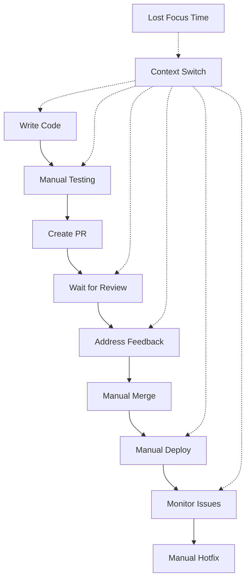

# Why GitHub Workflows? 🚀

<div class="text-lg mb-8">

**GitHub Workflows** are the **foundation** of agentic development - they enable 
agents to independently react to code changes and execute actions.

</div>

## The Problem Without Automation

- **Manual code reviews** take hours to days
- **Testing** is forgotten or delayed
- **Deployment** is error-prone and inconsistent  
- **Issue management** consumes developer time
- **Quality gates** are bypassed under time pressure

---
layout: two-cols
layoutClass: gap-16
---

# Manual vs. Automated Workflows 🆚

## 👨‍💻 Manual Process
```
Developer creates PR
↓
Manual code review request
↓  
Wait for reviewer availability
↓
Review feedback loop
↓
Manual testing
↓
Manual merge
↓
Manual deployment
↓
Manual issue closure

⏱️ Time: 2-5 days
🐛 Error Rate: 15-25%
```

::right::

## 🤖 Automated Workflow
```
Developer creates PR
↓ (instant)
Automated tests run
↓ (2-5 minutes)  
AI code review
↓ (30 seconds)
Quality checks pass
↓ (instant)
Auto-merge if approved
↓ (instant)
Auto-deployment
↓ (5-10 minutes)
Auto-issue management

⏱️ Time: 15-30 minutes  
🐛 Error Rate: 2-5%
```

---
layout: default
---

# GitHub Actions: The Nervous System for Agents 🧠

<div class="grid grid-cols-2 gap-8">
<div>

## Event-Driven Architecture
- **Push Events**: Code changes trigger workflows
- **PR Events**: Reviews and checks automated
- **Issue Events**: Ticket management automation
- **Schedule Events**: Proactive maintenance
- **Workflow Events**: Agent-to-Agent communication

```yaml
on:
  pull_request:
    types: [opened, synchronize]
  issues:
    types: [opened, labeled]  
  schedule:
    - cron: '0 2 * * *'
```

</div>
<div>

## Agent Integration Points
- **Webhooks**: Real-time event notifications
- **API Access**: Full GitHub API integration  
- **Secrets Management**: Secure credential handling
- **Artifact Storage**: Build outputs and reports
- **Environment Management**: Staged deployments

<div class="mt-4 p-4 bg-blue-100 rounded-lg text-sm">
<strong>Key Insight:</strong> GitHub Actions = Agent Operating System
</div>

</div>
</div>

---
layout: default
---

# Real-World Impact: Numbers Don't Lie 📈

## Productivity Gains Through Automation

<div class="grid grid-cols-3 gap-6">
<div class="p-4 bg-green-100 rounded-lg text-center">

### ⚡ Speed
**90% faster**  
deployment cycles

15 min vs 2.5 hours  
manual process

</div>
<div class="p-4 bg-blue-100 rounded-lg text-center">

### 🎯 Quality  
**85% fewer**  
production bugs

Automated testing  
catches issues early

</div>
<div class="p-4 bg-purple-100 rounded-lg text-center">

### 💰 Cost
**60% reduction**  
in operational overhead  

Less manual work,  
more feature development

</div>
</div>

<div class="mt-6 text-center p-4 bg-yellow-100 rounded-lg">
<strong>Netflix Example:</strong> 1000+ deployments/day through workflow automation
</div>

---
layout: default
---

# The Developer Experience Problem 😰

## Context Switching Costs Productivity



<div class="text-center mt-4">
<strong>Problem:</strong> 8-12 context switches per feature = 4-6 hours "lost time"
</div>

---
layout: default
---

# GitHub Workflows Solve Core Pain Points 🎯

<div class="grid grid-cols-2 gap-8">
<div>

## Development Friction
- **❌ "Works on my machine"** → ✅ Consistent CI environment
- **❌ Forgotten tests** → ✅ Automated test gates  
- **❌ Manual security checks** → ✅ Automated vulnerability scans
- **❌ Inconsistent deployments** → ✅ Standardized deploy process

</div>
<div>

## Collaboration Issues
- **❌ Review bottlenecks** → ✅ AI-assisted reviews
- **❌ Merge conflicts** → ✅ Auto-rebase workflows
- **❌ Documentation gaps** → ✅ Auto-generated docs
- **❌ Issue tracking chaos** → ✅ Automated issue management

</div>
</div>

---
layout: fact
---

# The Workflow-Agent Connection

<div class="text-2xl">

**GitHub Workflows** = **Event System**  
**+ AI Agents** = **Decision Makers**  
**= Autonomous Development Pipeline**

</div>

<div class="text-center mt-8 text-lg opacity-75">
Workflows trigger agents, agents orchestrate workflows
</div>

---
layout: default
---

# Why Now is the Perfect Time ⏰

<div class="grid grid-cols-2 gap-8">
<div>

## Technology Convergence
- **GitHub Actions** maturity (5+ years production)
- **AI Models** can understand code (Claude, GPT-4)  
- **API Integration** easier than ever
- **Cloud Infrastructure** scales automatically

## Business Pressure
- **Developer Shortage**: 4M developers missing worldwide
- **Faster TTM**: Time-to-Market increasingly critical
- **Quality Demands**: Users expect zero downtime
- **Competition**: Teams without automation fall behind

</div>
<div>

## Success Stories
- **GitHub**: 85% of top 1000 repos use Actions
- **Shopify**: 300+ deployments/day through automation  
- **Spotify**: 99.95% uptime through automated rollbacks
- **Airbnb**: 50% fewer production incidents

<div class="mt-4 p-4 bg-green-100 rounded-lg text-sm">
<strong>Trend:</strong> Manual processes become competitive disadvantage
</div>

</div>
</div>

---
layout: two-cols
layoutClass: gap-16
---

# ROI of Workflow Automation 💰

## Cost Calculation  
```typescript
// Manual Process Costs
const manualProcess = {
  codeReview: 2, // hours per PR
  testing: 1.5,  // hours per feature
  deployment: 1, // hours per release
  bugFixes: 4,   // hours per production bug
  
  // Per month (team of 5)
  totalHours: (2 + 1.5 + 1 + 4) * 20 * 5, // 850h
  hourlyCost: 50, // €50/hour
  monthlyCost: 42500 // €42,500
};

// Automated Process
const automatedProcess = {
  setupTime: 40, // one-time setup hours
  maintenanceTime: 8, // hours per month  
  toolCosts: 200, // GitHub Pro + tools
  
  monthlyCost: (8 * 50) + 200, // €600
  savings: 41900 // €41,900/month
};
```

::right::

## Break-even Analysis
- **Setup Investment**: 40h × €50 = €2,000
- **Monthly Savings**: €41,900
- **Break-even**: 1.4 days! 🚀  
- **Annual ROI**: **25,000%**

<div class="mt-6 p-4 bg-gold-100 rounded-lg">
<strong>Conclusion:</strong> Workflow automation pays for itself within a week
</div>

---
layout: default
---

# The Path to Agentic Development 🛣️

## Evolution Stages

<div class="space-y-4">

**🟢 Level 1: Basic Automation** (CI/CD, Testing)  
→ Reduces manual tasks by 50%

**🟡 Level 2: Intelligent Workflows** (AI Reviews, Smart Deployments)  
→ Automates decisions, 70% fewer interventions

**🟠 Level 3: Agent Integration** (Claude Actions, Auto-fixes)  
→ Agents execute complex tasks, 85% automation

**🔴 Level 4: Autonomous Teams** (Multi-agent Collaboration)  
→ Full autonomous development pipeline, 95% automation

</div>

<div class="text-center mt-6 p-4 bg-blue-100 rounded-lg">
<strong>Workshop Goal:</strong> Level 1 → Level 3 in 5 tasks
</div>

---
layout: quote
---

# "The teams that master workflow automation today will be the ones building the products that define tomorrow."

Nat Friedman, Former GitHub CEO

---
layout: center
class: text-center
---

# 🎯 Ready for Practice?

## Let's build GitHub Workflows

<div class="text-sm mt-8 opacity-75">
From motivation to concrete workflow definitions
</div>