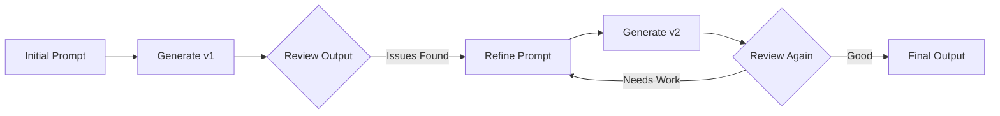

# 🛠️ Practical Application
## Understanding failure modes and solutions

---
layout: default
---

# ⚠️ Common Systemic Phenomena

<div class="overflow-x-auto">
<table class="w-full text-sm">
<thead>
<tr class="bg-gray-100 dark:bg-gray-800">
<th class="p-3 text-left">Phenomenon</th>
<th class="p-3 text-left">What happens</th>
<th class="p-3 text-left">Root cause</th>
</tr>
</thead>
<tbody>
<tr class="border-b">
<td class="p-3 font-semibold">Time Capsule Problem</td>
<td class="p-3">Knowledge frozen at training time</td>
<td class="p-3">Static training data</td>
</tr>
<tr class="border-b">
<td class="p-3 font-semibold">Lost in the Middle</td>
<td class="p-3">Forgets mid-context information</td>
<td class="p-3">Attention drop-off</td>
</tr>
<tr class="border-b">
<td class="p-3 font-semibold">Hallucination</td>
<td class="p-3">Makes up plausible but false info</td>
<td class="p-3">Probability fill-in</td>
</tr>
<tr class="border-b">
<td class="p-3 font-semibold">Primacy/Recency Bias</td>
<td class="p-3">Early or late info dominates</td>
<td class="p-3">Attention weighting</td>
</tr>
<tr>
<td class="p-3 font-semibold">Instruction Interference</td>
<td class="p-3">Later prompts override roles</td>
<td class="p-3">Context overwrite</td>
</tr>
</tbody>
</table>
</div>

---
layout: two-cols
---

# ⏳ The Time Capsule Problem

<div class="text-base space-y-3">

**Models are snapshots of the world at training time**

They can't "know" new facts unless:
- Retrained on new data
- Connected to external tools
- Given context explicitly

</div>

<div class="bg-red-50 dark:bg-red-900/20 p-4 rounded-lg mt-4">
<strong>Example:</strong><br/>
Ask about Vue 3.5 features<br/>
→ Model describes Vue 3.2<br/>
→ Extrapolates incorrectly
</div>

::right::

<div class="flex flex-col justify-center h-full">

**✅ Solutions:**

```typescript {1-3|5-7|9-11}
// 1. Retrieval-Augmented Generation
const context = await fetchDocs('Vue 3.5')
const response = llm.generate(context + prompt)

// 2. Tool/API lookups
const version = await getLatestVersion('vue')
const features = await getFeatures(version)

// 3. Date-aware prompting
prompt = `As of ${new Date()},
          using Vue ${version}...`
```

</div>

---
layout: default
---

# 🌀 Lost in the Middle

<div class="grid grid-cols-2 gap-6">

<div>
<h3 class="font-bold text-lg mb-3">The Problem:</h3>
<ul class="space-y-2">
<li>Strong attention to <strong>start and end</strong></li>
<li>Weak focus on <strong>middle sections</strong></li>
<li>Important details get lost</li>
</ul>

<div class="bg-yellow-50 dark:bg-yellow-900/20 p-4 rounded-lg mt-4">
<strong>Example:</strong><br/>
Give a 500-line file<br/>
→ Ask about line 250<br/>
→ Model might miss it entirely
</div>
</div>

<div>
<h3 class="font-bold text-lg mb-3">✅ Solutions:</h3>

```typescript {1-4|6-9|11-14}
// 1. Chunk and summarize
const chunks = splitIntoChunks(longFile, 100)
const summaries = chunks.map(summarize)
const response = process(summaries)

// 2. Hierarchical prompting
const outline = extractOutline(content)
const details = getRelevantSection(outline)
const result = processWithContext(details)

// 3. Clear anchors
prompt = `
In section 3 (lines 200-300),
you'll find the auth logic...`
```
</div>

</div>

---
layout: two-cols
layoutClass: gap-8
---

# 🎭 Hallucinations

<div class="text-base space-y-3">

**The model doesn't "lie"**
It **fills in missing info** statistically

- Confidently invents APIs
- Creates plausible libraries
- Generates realistic but wrong data
- No built-in "truth check"

</div>

<div class="bg-red-50 dark:bg-red-900/20 p-4 rounded-lg mt-4">
<strong>Real Example:</strong>
```javascript
// AI suggests:
import { useAsyncData } from '@vue/async'
// This package doesn't exist! 🚫
```
</div>

::right::

<div class="flex flex-col justify-center h-full">

**✅ Prevention Strategies:**

```typescript {1-3|5-8|10-13}
// 1. Ask for sources
"Provide documentation links
 for any APIs you use"

// 2. Verification tools
await runTests(generatedCode)
await typeCheck(generatedCode)
await lintCode(generatedCode)

// 3. Explicit constraints
"Only use APIs from Vue 3.4 docs.
 Do not invent new methods.
 Verify each import exists."
```

<div class="bg-green-50 dark:bg-green-900/20 p-4 rounded-lg mt-4">
💡 Always verify generated imports and APIs!
</div>

</div>

---
layout: default
---

# 🔄 Primacy & Recency Bias

<div class="bg-gradient-to-r from-blue-50 to-purple-50 dark:from-blue-900/20 dark:to-purple-900/20 p-6 rounded-xl mb-6">

**The model pays most attention to:**
1. 🎯 The very beginning (primacy)
2. 🎯 The very end (recency)
3. 😴 Less to the middle

</div>

<div class="grid grid-cols-2 gap-6">

<div>
<h4 class="font-bold mb-3">❌ Poor Structure:</h4>

```typescript
// Setup and context...
// Important config...
// Critical requirement ← Lost!
// More setup...
// Final instruction
```
</div>

<div>
<h4 class="font-bold mb-3">✅ Better Structure:</h4>

```typescript
// CRITICAL: Main requirement
// Supporting context...
// Details...
// REMEMBER: Main requirement
```
</div>

</div>

---
layout: two-cols
---

# 🎯 Instruction Interference

<div class="text-base space-y-3">

**Later prompts can override earlier context**

Common scenarios:
- System prompt gets ignored
- Role instructions forgotten
- Style guides overridden
- Constraints violated

</div>

<div class="bg-yellow-50 dark:bg-yellow-900/20 p-4 rounded-lg mt-4">
<strong>Example:</strong><br/>
System: "You are a Vue expert"<br/>
User: "Write React code"<br/>
→ Model switches to React
</div>

::right::

<div class="flex flex-col justify-center h-full">

**✅ Reinforcement Strategies:**

```typescript {1-4|6-10|12-15}
// 1. Repeat critical context
const prompt = `
Remember: Use Vue 3 Composition API
${userRequest}
Use Vue 3 Composition API only`

// 2. Structured prompts
const sections = {
  role: "Vue 3 developer",
  constraints: ["No React", "TypeScript"],
  task: userRequest
}

// 3. Validation checks
if (response.includes('React')) {
  regenerate(with_stronger_constraints)
}
```

</div>

---
layout: section
---

# 🚀 Working Effectively with LLMs
## Practical techniques for developers

---
layout: default
---

# 🧠 Effective Prompting Strategies

<div class="overflow-x-auto">
<table class="w-full">
<thead>
<tr class="bg-gradient-to-r from-blue-500/10 to-purple-500/10">
<th class="p-3 text-left">Technique</th>
<th class="p-3 text-left">Description</th>
<th class="p-3 text-left">Example</th>
</tr>
</thead>
<tbody>
<tr class="border-b">
<td class="p-3 font-semibold">Role Prompting</td>
<td class="p-3">Assigns expertise</td>
<td class="p-3 text-sm font-mono">"You are a senior Vue developer..."</td>
</tr>
<tr class="border-b">
<td class="p-3 font-semibold">Instruction Prompting</td>
<td class="p-3">Explicit steps</td>
<td class="p-3 text-sm font-mono">"Use &lt;script setup&gt; and add tests"</td>
</tr>
<tr class="border-b">
<td class="p-3 font-semibold">Chain of Thought</td>
<td class="p-3">Step-by-step reasoning</td>
<td class="p-3 text-sm font-mono">"Explain your reasoning, then code"</td>
</tr>
<tr class="border-b">
<td class="p-3 font-semibold">Few-Shot</td>
<td class="p-3">Provide examples</td>
<td class="p-3 text-sm font-mono">"Here are two components, follow this style"</td>
</tr>
<tr>
<td class="p-3 font-semibold">Iterative</td>
<td class="p-3">Improve over steps</td>
<td class="p-3 text-sm font-mono">"Now add prop validation"</td>
</tr>
</tbody>
</table>
</div>

---
layout: two-cols
---

# 📝 Role Prompting in Action

```typescript {1-6|8-13}
// Basic role
"You are a Vue developer.
 Create a button component."

// Enhanced role with context
"You are a senior Vue 3 developer
 with expertise in:
 - Composition API
 - TypeScript
 - Accessibility (WCAG 2.1)
 - Performance optimization

 Create an accessible, performant
 button component with full types."
```

::right::

<div class="flex flex-col justify-center h-full">

**Impact of Role Definition:**

<div class="space-y-3">
<div class="bg-red-50 dark:bg-red-900/20 p-3 rounded">
<strong>Without role:</strong><br/>
Generic, possibly outdated code
</div>

<div class="bg-green-50 dark:bg-green-900/20 p-3 rounded">
<strong>With role:</strong><br/>
Specific, modern, best-practice code
</div>
</div>

<div class="mt-4 text-sm opacity-75">
💡 Roles prime the model's "expertise"
</div>

</div>

---
layout: default
---

# 🔗 Chain of Thought Examples

<div class="grid grid-cols-2 gap-6">

<div>
<h3 class="font-bold text-lg mb-3">❌ Without CoT:</h3>

```typescript
// Prompt:
"Optimize this array operation"

// Response: Here's the code
const result = arr.filter().map()
```

<div class="text-sm mt-3 opacity-75">
Direct answer, no explanation
</div>
</div>

<div>
<h3 class="font-bold text-lg mb-3">✅ With CoT:</h3>

```typescript
// Prompt:
"Think step-by-step: analyze the
 performance issue, then optimize"

// Response:
// 1. Current issue: O(n²) complexity
// 2. Filter creates intermediate array
// 3. Solution: single pass with reduce
const result = arr.reduce(...)
```

<div class="text-sm mt-3 opacity-75">
Reasoned approach with explanation
</div>
</div>

</div>

---
layout: two-cols
layoutClass: gap-8
---

# 🎯 Few-Shot Learning

```vue {1-8|10-17|19-20}
<!-- Example 1 -->
<template>
  <button
    :class="buttonClasses"
    @click="emit('click')">
    <slot />
  </button>
</template>

<!-- Example 2 -->
<template>
  <input
    :class="inputClasses"
    v-model="modelValue"
    @input="emit('update')">
</template>

<!-- Now create similar for select -->
// Model follows the pattern...
```

::right::

<div class="flex flex-col justify-center h-full">

**Benefits of Examples:**
- Establishes coding style
- Shows expected structure
- Defines naming conventions
- Demonstrates patterns

<div class="bg-blue-50 dark:bg-blue-900/20 p-4 rounded-lg mt-4">
<strong>Pro tip:</strong><br/>
2-3 good examples > lengthy instructions
</div>

</div>

---
layout: default
---

# 🧩 Best Practices Checklist

<div class="grid grid-cols-2 gap-8">

<div>
<h3 class="font-bold text-lg mb-4">✅ DO:</h3>
<ul class="space-y-3">
<li class="flex items-start gap-2">
<span class="text-green-500">✓</span>
<span>Be explicit and specific</span>
</li>
<li class="flex items-start gap-2">
<span class="text-green-500">✓</span>
<span>Give structure (JSON, markdown)</span>
</li>
<li class="flex items-start gap-2">
<span class="text-green-500">✓</span>
<span>Separate thinking from output</span>
</li>
<li class="flex items-start gap-2">
<span class="text-green-500">✓</span>
<span>Provide examples when possible</span>
</li>
<li class="flex items-start gap-2">
<span class="text-green-500">✓</span>
<span>Iterate and refine</span>
</li>
</ul>
</div>

<div>
<h3 class="font-bold text-lg mb-4">❌ DON'T:</h3>
<ul class="space-y-3">
<li class="flex items-start gap-2">
<span class="text-red-500">✗</span>
<span>Overload one prompt</span>
</li>
<li class="flex items-start gap-2">
<span class="text-red-500">✗</span>
<span>Assume context is retained</span>
</li>
<li class="flex items-start gap-2">
<span class="text-red-500">✗</span>
<span>Trust without verification</span>
</li>
<li class="flex items-start gap-2">
<span class="text-red-500">✗</span>
<span>Use vague instructions</span>
</li>
<li class="flex items-start gap-2">
<span class="text-red-500">✗</span>
<span>Ignore model limitations</span>
</li>
</ul>
</div>

</div>

---
layout: two-cols
---

# 🛠️ Structured Output Formats

```typescript {1-7|9-15}
// Specify exact format
"Return a JSON object with:
{
  component: string,
  props: string[],
  methods: string[]
}"

// Use delimiters
"### Reasoning
[Your analysis here]

### Code
[Your implementation]"
```

::right::

<div class="flex flex-col justify-center h-full">

**Why Structure Matters:**
- Predictable parsing
- Easier post-processing
- Consistent responses
- Better error handling

<div class="bg-purple-50 dark:bg-purple-900/20 p-4 rounded-lg mt-4">
💡 Structured prompts → Structured thinking → Better results
</div>

</div>

---
layout: default
---

# ⚙️ Tools that Enhance LLM Output

<div class="grid grid-cols-2 gap-6 mb-6">

<div class="bg-blue-50 dark:bg-blue-900/20 p-5 rounded-lg">
<h3 class="font-bold text-lg mb-3">🔌 MCP Servers</h3>
<ul class="text-sm space-y-2">
<li>TypeScript type checking</li>
<li>ESLint validation</li>
<li>Test execution</li>
<li>Real-time verification</li>
</ul>
</div>

<div class="bg-green-50 dark:bg-green-900/20 p-5 rounded-lg">
<h3 class="font-bold text-lg mb-3">📚 RAG Systems</h3>
<ul class="text-sm space-y-2">
<li>Inject current documentation</li>
<li>Provide up-to-date APIs</li>
<li>Include project context</li>
<li>Add domain knowledge</li>
</ul>
</div>

</div>

<div class="grid grid-cols-2 gap-6">

<div class="bg-purple-50 dark:bg-purple-900/20 p-5 rounded-lg">
<h3 class="font-bold text-lg mb-3">📋 Rule Files</h3>
<ul class="text-sm space-y-2">
<li>Coding conventions</li>
<li>Project standards</li>
<li>Architecture patterns</li>
<li>Team preferences</li>
</ul>
</div>

<div class="bg-yellow-50 dark:bg-yellow-900/20 p-5 rounded-lg">
<h3 class="font-bold text-lg mb-3">🎯 Context Tools</h3>
<ul class="text-sm space-y-2">
<li>Smart chunking</li>
<li>Context windowing</li>
<li>Priority ordering</li>
<li>Relevance filtering</li>
</ul>
</div>

</div>

---
layout: default
---

# 🔄 Iterative Refinement Pattern



<div class="grid grid-cols-3 gap-4 mt-6">

<div class="bg-gray-50 dark:bg-gray-800 p-4 rounded-lg">
<h4 class="font-bold mb-2">Round 1</h4>
<p class="text-sm">"Create a Vue component"</p>
<p class="text-xs mt-2 opacity-75">Basic structure</p>
</div>

<div class="bg-gray-50 dark:bg-gray-800 p-4 rounded-lg">
<h4 class="font-bold mb-2">Round 2</h4>
<p class="text-sm">"Add TypeScript types"</p>
<p class="text-xs mt-2 opacity-75">Type safety added</p>
</div>

<div class="bg-gray-50 dark:bg-gray-800 p-4 rounded-lg">
<h4 class="font-bold mb-2">Round 3</h4>
<p class="text-sm">"Include error handling"</p>
<p class="text-xs mt-2 opacity-75">Production ready</p>
</div>

</div>
