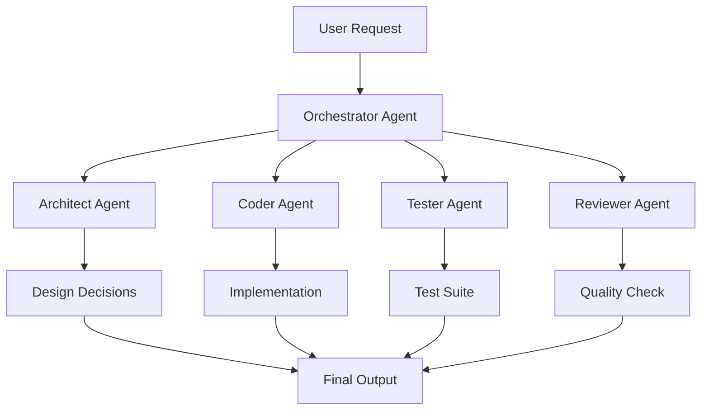

# 🚀 What If...
## Exploring possibilities and future directions

---
layout: center
---

# 🔍 Key Takeaways So Far

<div class="space-y-6 text-lg">

<div class="flex items-center gap-4">
<div class="text-3xl">🤖</div>
<div>LLMs don't understand — they <strong>approximate patterns</strong></div>
</div>

<div class="flex items-center gap-4">
<div class="text-3xl">🔢</div>
<div>Their behavior reflects <strong>math, not meaning</strong></div>
</div>

<div class="flex items-center gap-4">
<div class="text-3xl">⚡</div>
<div>Knowing failure modes lets you <strong>use them effectively</strong></div>
</div>

<div class="flex items-center gap-4">
<div class="text-3xl">💬</div>
<div>Prompting is <strong>software engineering for language</strong></div>
</div>

</div>


---
layout: default
---

# 🔮 What If: Custom Model Training?

<div class="grid grid-cols-2 gap-6">

<div>
<h3 class="font-bold text-lg mb-3">Fine-Tuning Possibilities:</h3>
<ul class="space-y-2">
<li>Your team's coding style</li>
<li>Company-specific patterns</li>
<li>Domain expertise</li>
<li>Project conventions</li>
</ul>

```typescript {1-5}
// Your model learns:
- Your component patterns
- Your naming conventions
- Your error handling
- Your testing approach
```
</div>

<div>
<h3 class="font-bold text-lg mb-3">Implementation Ideas:</h3>

```typescript {1-3|5-8|10-13}
// 1. Collect team patterns
const patterns = analyzeCodebase()
train(model, patterns)

// 2. Create specialized agents
const reviewer = createAgent('reviewer')
const tester = createAgent('tester')
const documenter = createAgent('docs')

// 3. Build feedback loops
const code = generate()
const feedback = review(code)
const improved = refine(code, feedback)
```
</div>

</div>

---
layout: default
---

# 🤝 What If: Multi-Agent Systems?



<div class="grid grid-cols-2 gap-4 mt-4">
<div class="bg-blue-50 dark:bg-blue-900/20 p-4 rounded-lg">
<strong>Specialized Agents:</strong><br/>
Each agent masters one domain
</div>
<div class="bg-green-50 dark:bg-green-900/20 p-4 rounded-lg">
<strong>Collaborative Output:</strong><br/>
Combined expertise for better results
</div>
</div>

---
layout: default
---

# 🏗️ What If: Building Your AI Toolkit?

<div class="grid grid-cols-3 gap-4">

<div class="bg-gradient-to-br from-blue-100 to-blue-200 dark:from-blue-900/30 dark:to-blue-800/30 p-4 rounded-lg">
<h3 class="font-bold mb-2">📝 Prompt Library</h3>
<ul class="text-sm space-y-1">
<li>Tested prompts</li>
<li>Team templates</li>
<li>Best practices</li>
</ul>
</div>

<div class="bg-gradient-to-br from-green-100 to-green-200 dark:from-green-900/30 dark:to-green-800/30 p-4 rounded-lg">
<h3 class="font-bold mb-2">🔧 Custom Tools</h3>
<ul class="text-sm space-y-1">
<li>MCP servers</li>
<li>Validation scripts</li>
<li>Integration tools</li>
</ul>
</div>

<div class="bg-gradient-to-br from-purple-100 to-purple-200 dark:from-purple-900/30 dark:to-purple-800/30 p-4 rounded-lg">
<h3 class="font-bold mb-2">🎯 Workflows</h3>
<ul class="text-sm space-y-1">
<li>Code review flow</li>
<li>Test generation</li>
<li>Doc automation</li>
</ul>
</div>

</div>

<div class="mt-6 p-4 bg-yellow-50 dark:bg-yellow-900/20 rounded-lg">
<strong>Start Small:</strong> Pick one workflow → Optimize it → Expand gradually
</div>

---
layout: center
---

# 🎯 Your Action Plan

<div class="space-y-6 text-lg max-w-2xl mx-auto">

<div class="bg-blue-50 dark:bg-blue-900/20 p-4 rounded-lg">
<strong>1. Start Experimenting</strong><br/>
Use AI tools consciously, note patterns
</div>

<div class="bg-green-50 dark:bg-green-900/20 p-4 rounded-lg">
<strong>2. Build Your Toolkit</strong><br/>
Create prompts, workflows, validations
</div>

<div class="bg-purple-50 dark:bg-purple-900/20 p-4 rounded-lg">
<strong>3. Stay Informed</strong><br/>
Follow AI developments, try new tools
</div>

<div class="bg-yellow-50 dark:bg-yellow-900/20 p-4 rounded-lg">
<strong>4. Share Knowledge</strong><br/>
Document learnings, help your team
</div>

</div>

---
layout: default
---

# ✨ Summary
## 📚 What We Learned

| Concept       | Description            |
|---------------|-----------------------|
| Tokenization  | Words → Numbers       |
| Embeddings    | Meaning → Geometry    |
| Attention     | Tokens talking        |
| Prediction    | Statistical guessing  |
| Phenomena     | Structural limits     |
| Prompting     | Human interface       |
