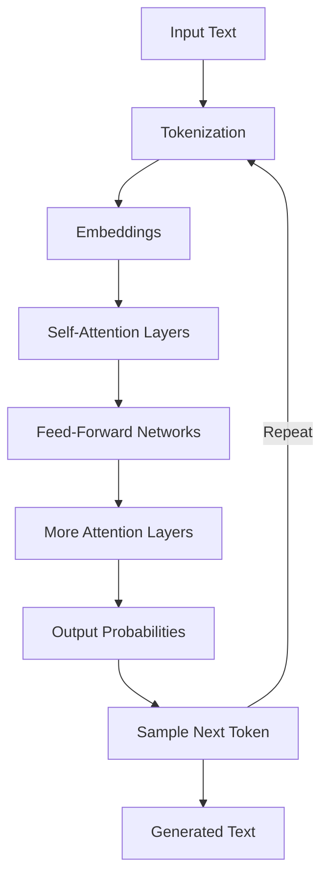

# 📚 Core Concepts
## Understanding the fundamentals

---
layout: center
---

# 🧱 The Core Idea

<div class="text-2xl font-bold text-center p-8 bg-gradient-to-r from-blue-500/10 to-purple-500/10 rounded-xl">
A Language Model doesn't understand language —<br/>
it predicts what comes <span class="text-purple-500">next</span>, one token at a time.
</div>

---
layout: default
---

# 🔤 Step 1: Tokenization

<div class="text-lg font-semibold mb-4">Text → Tokens → Numbers</div>

**Example:** "I love Vue.js"

<div class="bg-gray-50 dark:bg-gray-800 p-4 rounded-lg mt-4">
<table class="w-full">
<thead>
<tr class="border-b">
<th class="text-left p-2">Original</th>
<th class="text-left p-2">Tokens</th>
<th class="text-left p-2">Token IDs</th>
</tr>
</thead>
<tbody>
<tr><td class="p-2">I</td><td class="p-2 font-mono">I</td><td class="p-2">521</td></tr>
<tr><td class="p-2">love</td><td class="p-2 font-mono">love</td><td class="p-2">2407</td></tr>
<tr><td class="p-2">Vue</td><td class="p-2 font-mono">Vu + e</td><td class="p-2">119, 83</td></tr>
<tr><td class="p-2">.js</td><td class="p-2 font-mono">. + js</td><td class="p-2">13, 542</td></tr>
</tbody>
</table>
</div>

<div class="mt-6 text-base">
💡 **Key insight:** Each token = a small piece of text → converted to a number
</div>

---
layout: two-cols
layoutClass: gap-16
---

# 🎯 Tokenization in Practice

```javascript {1-3|5-7|9-10}
// Simple text
"Hello world"
// → ["Hello", " world"]

// Code gets complex
"const x = 42;"
// → ["const", " x", " =", " 42", ";"]

// Special characters matter
"user@email.com"
// → ["user", "@", "email", ".", "com"]
```

::right::


**Why this matters**
- Token limits = not character limits
- Special chars can explode token count
- Different languages tokenize differently
- Affects prompt engineering strategies


---
layout: two-cols
---

# 🧭 Step 2: Embeddings

<div class="text-lg font-semibold mb-4">Each token becomes a <span class="text-blue-500">vector</span> in high-dimensional space</div>

## Semantic Similarity
- "Developer" ≈ "Programmer"
- "Vue" ≈ "React" (both are frameworks)
- "function" ≈ "method"

## Contextual Distance
- "Cat" ≠ "for-loop"
- "Database" ≠ "Banana"

::right::

<div class="bg-gradient-to-br from-blue-100 to-purple-100 dark:from-blue-900/20 dark:to-purple-900/20 p-2 mt-14 rounded-lg">
<h3 class="font-bold mb-3">🟣 Think of it as:</h3>
<p class="text-base"><strong>Geometry of meaning</strong>, not logic</p>
<p class="text-sm mt-2 opacity-75">Words with similar meanings are close in vector space</p>
</div>


---
layout: center
---

# 📊 Embedding Visualization: The Basics

<div class="text-xl font-semibold mb-6">Words become points in space</div>

<div class="flex justify-center">
<svg width="500" height="220" viewBox="0 0 500 220">
  <!-- Coordinate system -->
  <line x1="100" y1="180" x2="400" y2="180" stroke="#888" stroke-width="2"/>
  <line x1="100" y1="40" x2="100" y2="180" stroke="#888" stroke-width="2"/>

  <!-- Dimension labels -->
  <text x="400" y="200" font-size="4" fill="#666">Dimension 1</text>
  <text x="60" y="40" font-size="4" fill="#666">Dimension 2</text>

  <!-- Word as a point -->
  <circle cx="250" cy="100" r="6" fill="#6366f1" />
  <text x="260" y="95" font-size="4" font-weight="bold">"Vue"</text>

  <!-- Vector representation -->
  <line x1="100" y1="180" x2="250" y2="100" stroke="#6366f1" stroke-width="2" stroke-dasharray="5,5" />

  <!-- Vector coordinates -->
  <rect x="270" y="105" width="120" height="30" rx="4" fill="#f3f4f6" stroke="#d1d5db"/>
  <text x="280" y="125" font-size="3" font-family="monospace">[0.6, 0.4, ...]</text>
</svg>
</div>

<div class="text-center text-base mt-4">
💡 <strong>In reality:</strong> Each word = a point in 768-dimensional space or higher
</div>

---
layout: two-cols
layoutClass: gap-8
---

# 📈 Similar vs Different Words

<div class="mb-4">
Words with similar meanings are close together:
</div>

```typescript
// Similar meaning = similar vectors
const developer = [0.2, 0.8, 0.1, ...]
const programmer = [0.21, 0.79, 0.11, ...]
```

<div class="mt-4 mb-4">
Words with different meanings are far apart:
</div>

```typescript
// Different meaning = different vectors
const database = [0.9, 0.1, 0.3, ...]
const banana = [0.1, 0.2, 0.95, ...]
```

::right::

<div class="flex items-center justify-center h-full">
<svg width="300" height="300" viewBox="0 0 300 300">
  <!-- Coordinate system -->
  <line x1="50" y1="250" x2="250" y2="250" stroke="#888" stroke-width="2"/>
  <line x1="50" y1="50" x2="50" y2="250" stroke="#888" stroke-width="2"/>

  <!-- Similar words cluster -->
  <circle cx="140" cy="70" r="5" fill="#6366f1" />
  <text x="148" y="70" font-size="4">developer</text>

  <circle cx="150" cy="100" r="5" fill="#6366f1" />
  <text x="158" y="100" font-size="4">programmer</text>

  <circle cx="135" cy="85" r="5" fill="#6366f1" />
  <text x="143" y="85" font-size="4">coder</text>

  <!-- Different words far apart -->
  <circle cx="80" cy="220" r="5" fill="#ef4444" />
  <text x="88" y="220" font-size="4">database</text>

  <circle cx="220" cy="120" r="5" fill="#22c55e" />
  <text x="228" y="120" font-size="4">  banana</text>
</svg>
</div>

---
layout: center
---

# 🔄 Context Changes Meaning

<div class="flex justify-center">
<svg width="550" height="300" viewBox="0 0 550 300">
  <!-- Coordinate axes -->
  <line x1="70" y1="240" x2="480" y2="240" stroke="#888" stroke-width="2"/>
  <line x1="70" y1="60" x2="70" y2="240" stroke="#888" stroke-width="2"/>

  <!-- First context circle -->
  <circle cx="170" cy="140" r="60" fill="rgba(99, 102, 241, 0.1)" stroke="#6366f1" stroke-width="1"/>
  <text x="170" y="80" font-size="4" text-anchor="middle" fill="#6366f1">Financial Context</text>

  <!-- Second context circle -->
  <circle cx="380" cy="180" r="60" fill="rgba(34, 197, 94, 0.1)" stroke="#22c55e" stroke-width="1"/>
  <text x="380" y="120" font-size="4" text-anchor="middle" fill="#22c55e">Nature Context</text>

  <!-- Bank in first context -->
  <circle cx="170" cy="140" r="6" fill="#6366f1" />
  <text x="150" y="140" font-size="4" font-weight="bold" text-anchor="end">bank</text>

  <!-- Bank in second context -->
  <circle cx="380" cy="180" r="6" fill="#22c55e" />
  <text x="400" y="180" font-size="4" font-weight="bold">bank</text>

  <!-- Related words in contexts -->
  <circle cx="150" cy="120" r="4" fill="#6366f1" opacity="0.7" />
  <text x="140" y="120" font-size="3" text-anchor="end">money</text>

  <circle cx="190" cy="160" r="4" fill="#6366f1" opacity="0.7" />
  <text x="200" y="160" font-size="3">account</text>

  <circle cx="360" cy="160" r="4" fill="#22c55e" opacity="0.7" />
  <text x="350" y="160" font-size="3" text-anchor="end">river</text>

  <circle cx="400" cy="200" r="4" fill="#22c55e" opacity="0.7" />
  <text x="410" y="200" font-size="3">shore</text>
</svg>
</div>

<div class="text-center text-base mt-4">
💡 <strong>Key insight:</strong> The same word has different vectors depending on context
</div>

---
layout: center
---

# ⚙️ Step 3: Transformer Architecture

<div class="text-xl font-semibold mb-6">The "brain" of modern LLMs</div>

<div class="flex justify-center">
<svg width="550" height="280" viewBox="0 0 550 280">
  <!-- Main transformer architecture outline -->
  <rect x="100" y="40" width="350" height="220" rx="10" fill="rgba(99, 102, 241, 0.1)" stroke="#6366f1" stroke-width="2"/>
  <text x="275" y="30" font-size="6" text-anchor="middle" font-weight="bold" fill="#6366f1">Transformer</text>

  <!-- Input and output areas -->
  <rect x="150" y="60" width="250" height="30" rx="5" fill="#f3f4f6" stroke="#d1d5db"/>
  <text x="275" y="80" font-size="5" text-anchor="middle">Input Tokens</text>

  <!-- Architecture components -->
  <rect x="150" y="110" width="250" height="40" rx="5" fill="rgba(59, 130, 246, 0.2)" stroke="#3b82f6"/>
  <text x="275" y="135" font-size="5" text-anchor="middle" fill="#3b82f6">Self-Attention Mechanisms</text>

  <rect x="150" y="160" width="250" height="40" rx="5" fill="rgba(16, 185, 129, 0.2)" stroke="#10b981"/>
  <text x="275" y="185" font-size="5" text-anchor="middle" fill="#10b981">Feed-Forward Networks</text>

  <rect x="150" y="210" width="250" height="40" rx="5" fill="#f3f4f6" stroke="#d1d5db"/>
  <text x="275" y="235" font-size="5" text-anchor="middle">Output Probabilities</text>

  <!-- Flow arrows -->
  <line x1="275" y1="90" x2="275" y2="110" stroke="#888" stroke-width="1" marker-end="url(#arrow)"/>
  <line x1="275" y1="150" x2="275" y2="160" stroke="#888" stroke-width="1" marker-end="url(#arrow)"/>
  <line x1="275" y1="200" x2="275" y2="210" stroke="#888" stroke-width="1" marker-end="url(#arrow)"/>

  <!-- Arrow marker definition -->
  <defs>
    <marker id="arrow" markerWidth="10" markerHeight="10" refX="9" refY="3" orient="auto" markerUnits="strokeWidth">
      <path d="M0,0 L0,6 L9,3 z" fill="#888" />
    </marker>
  </defs>
</svg>
</div>

<div class="text-center text-base mt-4">
💡 <strong>Key insight:</strong> Transformers use attention to understand relationships between words
</div>

---
layout: default
---

# 🔍 How Self-Attention Works

## How it works
- Each token asks: "How relevant are other tokens to me?"
- Creates connections of varying strengths
- Captures relationships regardless of distance

> Self-attention helps tokens "look at" other tokens in the sequence

<div class="mt-4 mb-4 bg-blue-50 dark:bg-blue-900/20 p-4 rounded-lg">
💡 <strong>Key advantage:</strong> Unlike older models, transformers can see the entire context at once
</div>

---
layout: default
---

# 📝 Self-Attention Example

<div class="text-lg font-semibold mb-4">"The developer who loves Vue writes clean code."</div>

<div class="flex justify-center mb-6 mt-2">
<svg width="550" height="200" viewBox="0 0 550 200">
  <!-- Tokens -->
  <rect x="45" y="40" width="80" height="30" rx="5" fill="rgba(99, 102, 241, 0.1)" stroke="#6366f1"/>
  <text x="85" y="60" font-size="4" text-anchor="middle">developer</text>

  <rect x="170" y="40" width="70" height="30" rx="5" fill="rgba(99, 102, 241, 0.1)" stroke="#6366f1"/>
  <text x="205" y="60" font-size="4" text-anchor="middle">loves</text>

  <rect x="290" y="40" width="70" height="30" rx="5" fill="rgba(59, 130, 246, 0.2)" stroke="#3b82f6" stroke-width="2"/>
  <text x="325" y="60" font-size="4" text-anchor="middle" font-weight="bold" fill="#3b82f6">Vue</text>

  <rect x="410" y="40" width="70" height="30" rx="5" fill="rgba(99, 102, 241, 0.1)" stroke="#6366f1"/>
  <text x="445" y="60" font-size="4" text-anchor="middle">writes</text>

  <!-- Attention connections from "Vue" to other tokens -->
  <line x1="325" y1="70" x2="85" y2="70" stroke="#3b82f6" stroke-width="1.5" stroke-opacity="0.5" marker-end="url(#bluearrow)"/>
  <line x1="325" y1="70" x2="205" y2="70" stroke="#3b82f6" stroke-width="2" stroke-opacity="0.8" marker-end="url(#bluearrow)"/>
  <line x1="325" y1="70" x2="445" y2="70" stroke="#3b82f6" stroke-width="0.8" stroke-opacity="0.3" marker-end="url(#bluearrow)"/>

  <!-- Attention percentages -->
  <text x="150" y="85" font-size="3" fill="#3b82f6">30% attention</text>
  <text x="265" y="85" font-size="3" fill="#3b82f6">60% attention</text>
  <text x="380" y="85" font-size="3" fill="#3b82f6">10% attention</text>

  <!-- Interpretation -->
  <rect x="50" y="120" width="430" height="60" rx="8" fill="rgba(59, 130, 246, 0.05)" stroke="#3b82f6" stroke-dasharray="2,2"/>
  <text x="265" y="145" font-size="4" text-anchor="middle" fill="#3b82f6">
    Vue pays most attention to "loves" (relationship) a
  </text>
  <text x="265" y="165" font-size="4" text-anchor="middle" fill="#3b82f6">
    and some to "developer" (subject)
  </text>

  <!-- Arrow marker definition -->
  <defs>
    <marker id="bluearrow" markerWidth="10" markerHeight="10" refX="9" refY="3" orient="auto" markerUnits="strokeWidth">
      <path d="M0,0 L0,6 L9,3 z" fill="#3b82f6" />
    </marker>
  </defs>
</svg>
</div>

<div class="grid grid-cols-2 gap-6">
<div class="bg-gradient-to-r from-blue-50 to-blue-100 dark:from-blue-900/10 dark:to-blue-900/20 p-4 rounded-lg">
<strong>What attention captures:</strong>
<ul class="mt-2">
<li>Grammatical relationships</li>
<li>Semantic connections</li>
<li>Long-range dependencies</li>
</ul>
</div>

<div class="bg-gradient-to-r from-purple-50 to-purple-100 dark:from-purple-900/10 dark:to-purple-900/20 p-4 rounded-lg">
<strong>Benefits:</strong>
<ul class="mt-2">
<li>Handles variable-length sequences</li>
<li>Processes all tokens in parallel</li>
<li>Connects distant tokens directly</li>
</ul>
</div>
</div>

---
layout: default
---

# 🔁 Step 4: Attention in Action

<div class="space-y-4">

<div class="bg-blue-50 dark:bg-blue-900/20 p-5 rounded-lg">
<h3 class="font-bold text-lg mb-2">How Attention Works:</h3>
<ul class="space-y-2">
<li>Each token looks at <strong>every other token</strong></li>
<li>Decides: <em>"How relevant are you to me?"</em></li>
<li>Creates weighted connections (attention scores)</li>
</ul>
</div>

<div class="grid grid-cols-3 gap-4 mt-6">
<div class="text-center p-3 bg-gray-100 dark:bg-gray-800 rounded">
<div class="text-2xl mb-2">👁️</div>
<div class="font-semibold">Query</div>
<div class="text-sm">What am I looking for?</div>
</div>
<div class="text-center p-3 bg-gray-100 dark:bg-gray-800 rounded">
<div class="text-2xl mb-2">🔑</div>
<div class="font-semibold">Key</div>
<div class="text-sm">What do I offer?</div>
</div>
<div class="text-center p-3 bg-gray-100 dark:bg-gray-800 rounded">
<div class="text-2xl mb-2">💎</div>
<div class="font-semibold">Value</div>
<div class="text-sm">What information I provide</div>
</div>
</div>

</div>

---
layout: center
---

# 🧩 Multi-Head Attention

<div class="text-xl font-semibold mb-4">Multiple "experts" looking at the same tokens</div>

<div class="flex justify-center">
<svg width="550" height="280" viewBox="0 0 550 280">
  <!-- Input tokens -->
  <rect x="120" y="20" width="300" height="30" rx="5" fill="#f3f4f6" stroke="#d1d5db"/>
  <text x="275" y="40" font-size="4" text-anchor="middle">Input: "The developer loves Vue"</text>

  <!-- Multiple attention heads -->
  <rect x="50" y="90" width="130" height="90" rx="8" fill="rgba(139, 92, 246, 0.1)" stroke="#8b5cf6"/>
  <text x="115" y="80" font-size="3" text-anchor="middle" fill="#8b5cf6">Head 1: Syntax Focus</text>
  <line x1="115" y1="50" x2="115" y2="90" stroke="#8b5cf6" stroke-width="1" stroke-dasharray="2,2"/>

  <rect x="210" y="90" width="130" height="90" rx="8" fill="rgba(14, 165, 233, 0.1)" stroke="#0ea5e9"/>
  <text x="275" y="80" font-size="3" text-anchor="middle" fill="#0ea5e9">Head 2: Subject Focus</text>
  <line x1="275" y1="50" x2="275" y2="90" stroke="#0ea5e9" stroke-width="1" stroke-dasharray="2,2"/>

  <rect x="370" y="90" width="130" height="90" rx="8" fill="rgba(34, 197, 94, 0.1)" stroke="#22c55e"/>
  <text x="435" y="80" font-size="3" text-anchor="middle" fill="#22c55e">Head 3: Object Focus</text>
  <line x1="435" y1="50" x2="435" y2="90" stroke="#22c55e" stroke-width="1" stroke-dasharray="2,2"/>

  <!-- Head contents with different attention patterns -->
  <!-- Head 1 connections -->
  <circle cx="80" cy="130" r="10" fill="#f3f4f6" stroke="#8b5cf6"/>
  <text x="80" y="155" font-size="3" text-anchor="middle">developer</text>
  <circle cx="150" cy="130" r="10" fill="#f3f4f6" stroke="#8b5cf6"/>
  <text x="150" y="155" font-size="3" text-anchor="middle">loves</text>
  <line x1="80" y1="130" x2="150" y2="130" stroke="#8b5cf6" stroke-width="2" stroke-opacity="0.8"/>

  <!-- Head 2 connections -->
  <circle cx="240" cy="130" r="10" fill="#f3f4f6" stroke="#0ea5e9"/>
  <text x="240" y="155" font-size="3" text-anchor="middle">developer</text>
  <circle cx="310" cy="130" r="10" fill="#f3f4f6" stroke="#0ea5e9"/>
  <text x="310" y="155" font-size="3" text-anchor="middle">Vue</text>
  <line x1="240" y1="130" x2="310" y2="130" stroke="#0ea5e9" stroke-width="2" stroke-opacity="0.8"/>

  <!-- Head 3 connections -->
  <circle cx="400" cy="130" r="10" fill="#f3f4f6" stroke="#22c55e"/>
  <text x="400" y="155" font-size="3" text-anchor="middle">loves</text>
  <circle cx="470" cy="130" r="10" fill="#f3f4f6" stroke="#22c55e"/>
  <text x="470" y="155" font-size="3" text-anchor="middle">Vue</text>
  <line x1="400" y1="130" x2="470" y2="130" stroke="#22c55e" stroke-width="2" stroke-opacity="0.8"/>

  <!-- Combined output -->
  <rect x="165" y="220" width="220" height="40" rx="5" fill="rgba(99, 102, 241, 0.1)" stroke="#6366f1"/>
  <text x="275" y="245" font-size="4" text-anchor="middle" fill="#6366f1">Combined Attention Output</text>

  <!-- Combination arrows -->
  <line x1="115" y1="180" x2="275" y2="220" stroke="#8b5cf6" stroke-width="1" stroke-opacity="0.6" marker-end="url(#purplearrow)"/>
  <line x1="275" y1="180" x2="275" y2="220" stroke="#0ea5e9" stroke-width="1" stroke-opacity="0.6" marker-end="url(#bluearrow2)"/>
  <line x1="435" y1="180" x2="275" y2="220" stroke="#22c55e" stroke-width="1" stroke-opacity="0.6" marker-end="url(#greenarrow)"/>

  <!-- Arrow definitions -->
  <defs>
    <marker id="purplearrow" markerWidth="10" markerHeight="10" refX="9" refY="3" orient="auto" markerUnits="strokeWidth">
      <path d="M0,0 L0,6 L9,3 z" fill="#8b5cf6" />
    </marker>
    <marker id="bluearrow2" markerWidth="10" markerHeight="10" refX="9" refY="3" orient="auto" markerUnits="strokeWidth">
      <path d="M0,0 L0,6 L9,3 z" fill="#0ea5e9" />
    </marker>
    <marker id="greenarrow" markerWidth="10" markerHeight="10" refX="9" refY="3" orient="auto" markerUnits="strokeWidth">
      <path d="M0,0 L0,6 L9,3 z" fill="#22c55e" />
    </marker>
  </defs>
</svg>
</div>

<div class="grid grid-cols-2 gap-6 mt-4 max-w-3xl mx-auto">
<div class="bg-purple-50 dark:bg-purple-900/20 p-3 rounded-lg text-sm">
💡 <strong>Each head focuses on different patterns:</strong>
<ul class="list-disc ml-5 mt-1">
<li>Syntax relationships</li>
<li>Semantic connections</li>
<li>Contextual dependencies</li>
</ul>
</div>

<div class="bg-blue-50 dark:bg-blue-900/20 p-3 rounded-lg text-sm">
🎯 <strong>Benefits:</strong>
<ul class="list-disc ml-5 mt-1">
<li>Captures multiple types of relationships</li>
<li>More robust understanding</li>
<li>Like having many experts analyze the text</li>
</ul>
</div>
</div>

---
layout: default
---

# 📃 Transformer Building Blocks

<div class="grid grid-cols-2 gap-8">
<div>
<div class="text-lg font-semibold mb-4">Core Components:</div>

<div class="space-y-4">
<div class="bg-blue-50 dark:bg-blue-900/20 p-4 rounded-lg">
<strong>1. Self-Attention Layer</strong>
<ul class="mt-2 space-y-1">
<li>Learns relationships between tokens</li>
<li>Uses multiple attention heads</li>
<li>Creates context-aware representations</li>
</ul>
</div>

<div class="bg-green-50 dark:bg-green-900/20 p-4 rounded-lg">
<strong>2. Feed-Forward Networks</strong>
<ul class="mt-2 space-y-1">
<li>Processes each token independently</li>
<li>Adds deeper understanding</li>
<li>Non-linear transformations</li>
</ul>
</div>
</div>
</div>

<div>
<div class="text-lg font-semibold mb-4">Architecture Features:</div>

<div class="space-y-4">
<div class="bg-yellow-50 dark:bg-yellow-900/20 p-4 rounded-lg">
<strong>3. Residual Connections</strong>
<ul class="mt-2 space-y-1">
<li>Preserves information across layers</li>
<li>Helps with training deeper networks</li>
</ul>
</div>

<div class="bg-purple-50 dark:bg-purple-900/20 p-4 rounded-lg">
<strong>4. Layer Normalization</strong>
<ul class="mt-2 space-y-1">
<li>Stabilizes learning</li>
<li>Normalizes inputs at each layer</li>
</ul>
</div>
</div>
</div>
</div>


---
layout: default
---

# 🔮 Step 5: Next-Token Prediction

<div class="text-lg font-semibold mb-6">The model predicts the next most probable token</div>

**Example Prompt:** `const greeting =`

<div class="bg-gray-50 dark:bg-gray-800 p-6 rounded-lg">
<table class="w-full">
<thead>
<tr class="border-b-2">
<th class="text-left p-3">Next Token</th>
<th class="text-left p-3">Probability</th>
<th class="text-left p-3">Cumulative</th>
</tr>
</thead>
<tbody>
<tr class="border-b">
<td class="p-3 font-mono">"Hello"</td>
<td class="p-3">52%</td>
<td class="p-3">52%</td>
</tr>
<tr class="border-b">
<td class="p-3 font-mono">'Hi'</td>
<td class="p-3">22%</td>
<td class="p-3">74%</td>
</tr>
<tr class="border-b">
<td class="p-3 font-mono">`Welcome`</td>
<td class="p-3">15%</td>
<td class="p-3">89%</td>
</tr>
<tr>
<td class="p-3 font-mono">getUserName()</td>
<td class="p-3">11%</td>
<td class="p-3">100%</td>
</tr>
</tbody>
</table>
</div>

<div class="mt-6 text-base">
🎲 It "rolls the dice" (weighted by probability) → picks one → repeats
</div>

---
layout: two-cols
---

# 🎰 Temperature & Sampling

```javascript {1-3|5-8|10-13}
// Temperature = 0.0 (deterministic)
const response = "Hello"
// Always picks highest probability

// Temperature = 0.7 (balanced)
const response = oneOf([
  "Hello", "Hi", "Greetings"
])
// Some variety, still coherent

// Temperature = 1.5 (creative)
const response = oneOf([
  "Salutations", "Yo!", "Howdy"
])
// More random, less predictable
```

::right::

<div class="flex flex-col justify-center h-full">

**Temperature Controls:**
- **Low (0-0.3):** Focused, deterministic
- **Medium (0.5-0.8):** Balanced creativity
- **High (1.0+):** Random, creative

<div class="bg-blue-50 dark:bg-blue-900/20 p-4 rounded-lg mt-4">
<strong>For code:</strong> Use low temperature<br/>
<strong>For ideas:</strong> Use higher temperature
</div>

</div>

---
layout: center
---

# 🧮 Why it feels intelligent

<div class="space-y-6 text-lg">

<div class="flex items-center gap-4">
<div class="text-3xl">📊</div>
<div>Grammar and coherence <strong>emerge statistically</strong></div>
</div>

<div class="flex items-center gap-4">
<div class="text-3xl">🔍</div>
<div>Billions of parameters capture <strong>patterns</strong>, not <strong>truth</strong></div>
</div>

<div class="flex items-center gap-4">
<div class="text-3xl">🎭</div>
<div>LLMs <em>simulate</em> reasoning but don't <em>have</em> understanding</div>
</div>

</div>

---
layout: fact
---

# 175B+
Parameters in GPT-4

<div class="text-base mt-4 opacity-75">
Each parameter is a learned weight in the neural network
</div>

---
layout: default
---

# 🏗️ The Complete Pipeline



<div class="mt-6 bg-gradient-to-r from-blue-50 to-purple-50 dark:from-blue-900/20 dark:to-purple-900/20 p-4 rounded-lg">
💡 <strong>Key Insight:</strong> This entire process runs for EVERY single token generated
</div>
