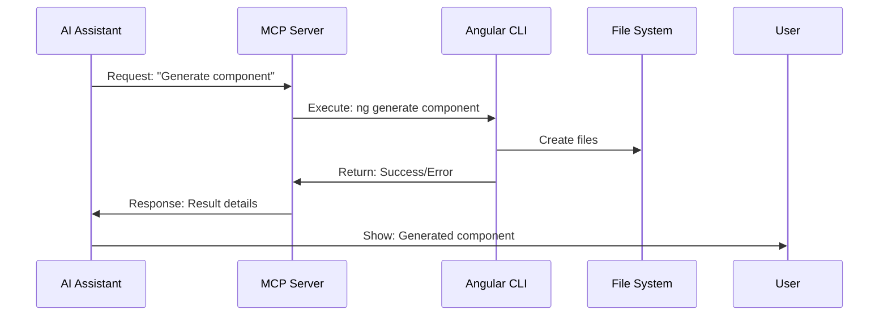

# What is Model Context Protocol?

## A Standardized Framework for AI Integration

<div class="grid grid-cols-2 gap-8 mt-8">

<div>

### Core Concept

**MCP** is a protocol that enables AI assistants to interact with external tools and data sources in a standardized way.

</div>

<div>


</div>

</div>

---
layout: default
---

# Agents Use MCP Tools Out of the Box

- Most AI agents support **MCP tool calls** natively
- Common built-in tools:
  - **File access** (read/write project files)
  - **Bash** (run shell commands)
  - **PowerShell** (Windows automation)
  - **Browser** (web navigation and scraping)
- Enables agents to interact with your environment immediately

## Example prompt

```text
Browse http://site.org and summarise its contents
```

---

# Easily Add MCP Servers to Any Agent

- **MCP servers** can be integrated with any agent platform
- Extend agent capabilities with custom tools and data sources
- Simple setup—see [mcp.so](https://mcp.so) for guides and ready-to-use servers
- Scale from local development to cloud-based workflows


---
layout: default
---

# MCP Architecture

## Three Core Components

<div class="grid grid-cols-3 gap-6">

<div class="p-4 bg-blue-100 dark:bg-blue-900 rounded-lg">

### **Resources**

_Like GET endpoints_

- Provide data to AI
- Read-only information
- Project files, configurations
- Real-time data streams

</div>

<div class="p-4 bg-green-100 dark:bg-green-900 rounded-lg">

### **Tools**

_Like POST endpoints_

- Enable AI to perform actions
- Execute commands
- Modify files
- Interact with external systems

</div>

<div class="p-4 bg-purple-100 dark:bg-purple-900 rounded-lg">

### **Prompts**

_Reusable templates_

- Pre-defined interaction patterns
- Common workflows
- Best practice templates
- Context-aware suggestions

</div>

</div>

---
layout: default
---

# MCP Communication Flow

## How AI and Tools Interact

<div class="text-center">



</div>

<div class="mt-6 p-4 bg-gray-100 dark:bg-gray-800 rounded-lg">

**Key Point**: MCP acts as a secure bridge between AI assistants and your development tools.

</div>

---
layout: default
---

# MCP Server vs Client

## The Two Sides of MCP

<div class="grid grid-cols-2 gap-8">

<div>

### MCP Server

- Exposes tools and resources
- Handles AI requests
- Executes actual commands
- Manages security and permissions

```typescript
// Server registers tools
server.registerTool(
  "generate_component",
  {
    // Tool definition
  },
  async (params) => {
    // Tool implementation
  },
);
```

</div>

<div>

### **MCP Client**

_AI Assistant (Cursor, Copilot)_

- Connects to MCP servers
- Makes requests to tools
- Receives responses
- Integrates with user interface

```typescript
// Client uses tools
const result = await mcpClient.callTool("generate_component", {
  name: "user-profile",
});
```

</div>

</div>

---
layout: default
---

# TypeScript SDK Overview

## Building MCP Servers Made Easy

<div class="space-y-6">

### **Core Classes**

```typescript
import { McpServer } from "@modelcontextprotocol/sdk/server/mcp.js";
import { StdioServerTransport } from "@modelcontextprotocol/sdk/server/stdio.js";
```

### **Key Features**

- **Type Safety** - Full TypeScript support
- **Transport Layer** - stdio, SSE, WebSocket support
- **Schema Validation** - Zod integration for input validation
- **Error Handling** - Built-in error management
- **Protocol Compliance** - Follows MCP specification

</div>

<div class="mt-8 p-4 bg-blue-100 dark:bg-blue-900 rounded-lg">

**The SDK handles all the protocol complexity, letting you focus on your tool logic.**

</div>

---
layout: default
---

# MCP Transport Options

## How AI and MCP Servers Communicate

<div class="grid grid-cols-2 gap-8">

<div>

### **STDIO Transport**

_Most Common_

- Standard input/output streams
- Simple process communication
- Works with any AI assistant
- Easy to debug and test

```typescript
const transport = new StdioServerTransport();
```

</div>

<div>

### **SSE Transport**

_Web-based_

- Server-Sent Events over HTTP
- Real-time communication
- Web application integration
- Browser compatibility

```typescript
const transport = new SSEServerTransport();
```

</div>

</div>

<div class="mt-8 p-4 bg-yellow-100 dark:bg-yellow-900 rounded-lg">

**For our Angular MCP server, we'll use STDIO transport for maximum compatibility.**

</div>

---
layout: default
---

# MCP Message Format

## Standardized Communication Protocol

<div class="space-y-4">

### **Request Format**

```json
{
  "jsonrpc": "2.0",
  "id": 1,
  "method": "tools/call",
  "params": {
    "name": "generate_component",
    "arguments": {
      "name": "user-profile",
      "path": "src/app/components"
    }
  }
}
```

### **Response Format**

```json
{
  "jsonrpc": "2.0",
  "id": 1,
  "result": {
    "content": [
      {
        "type": "text",
        "text": "✅ Component generated successfully"
      }
    ]
  }
}
```

</div>

<div class="mt-6 p-4 bg-green-100 dark:bg-green-900 rounded-lg">

**The SDK handles all JSON-RPC complexity automatically - you just define your tools!**

</div>

---
layout: default
---

# Security Considerations

## Safe AI Integration

<div class="grid grid-cols-2 gap-8">

<div>

### **What MCP Enables**

- Controlled tool access
- Permission-based execution
- Audit logging
- Sandboxed environments

</div>

<div>

### **Security Best Practices**

- Validate all inputs
- Limit tool capabilities
- Use least privilege principle
- Monitor tool usage

</div>

</div>

<div class="mt-8 p-4 bg-red-100 dark:bg-red-900 rounded-lg">

**Important**: MCP servers run with the same permissions as the user - implement proper validation and security measures.

</div>

---
layout: default
---

# MCP Ecosystem

## Growing Community and Tools

<div class="space-y-4">

### **Official MCP Servers**

- **Filesystem** - File operations
- **Git** - Version control
- **Database** - Data access
- **Web Search** - Information retrieval

### **Community Servers**

- **Docker** - Container management
- **AWS** - Cloud operations
- **Slack** - Team communication
- **Custom tools** - Project-specific

</div>

<div class="mt-8 p-4 bg-purple-100 dark:bg-purple-900 rounded-lg">

**Our Angular MCP server joins this ecosystem, providing Angular-specific development tools.**

</div>

---
layout: center
---

# Ready to Build?

## Now You Understand the Foundation

<div class="mt-8 text-2xl">

**Next**: Let's implement your first MCP server

</div>

<div class="mt-4">

<carbon:arrow-right class="inline-block w-8 h-8" />

</div>
